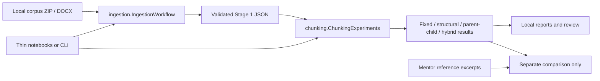

# Mentor-aligned architecture

The mentor's October 6, 2026 structure is the current layout. Stage 1 is
**ingestion/parsing** and Stage 2 is **chunking**. The original plan's separate
Clean stage and Stage 3 chunking numbering are historical, not the current sequence.

```text
property-due-diligence-copilot/
├── pyproject.toml
├── .env.example
├── docs/                         # Stage plans and this architecture
├── notebooks/                    # Thin workflow calls, explanations, visible outputs
├── data/                         # raw/processed/evaluation stay gitignored
├── migrations/                   # Future Neon/pgvector SQL
├── src/property_copilot/
│   ├── schemas/
│   │   ├── chunk.py              # SourceSpan, ChunkMetadata, Chunk
│   │   ├── legal.py              # Planned: Verdict, Evidence, Citation, LegalResult
│   │   └── api.py                # Planned: PropertyRequest, DueDiligenceResponse
│   ├── ingestion/               # Stage 1: DOCX → evidence-linked structured blocks
│   ├── chunking/                # Stage 2: structural, parent-child, hybrid experiments
│   ├── rag/
│   │   ├── embeddings.py         # Planned
│   │   ├── store.py              # Planned: pgvector
│   │   └── retriever.py          # Planned
│   ├── tools/
│   │   ├── act16.py              # Planned: pure habitation-certificate logic
│   │   └── mcp_server.py         # Planned: expose act16
│   ├── agents/
│   │   ├── legal_agent.py        # Planned: select tools, synthesize with citations
│   │   └── root_agent.py         # Planned: LangGraph parse → dispatch → aggregate
│   ├── api/
│   │   ├── main.py               # FastAPI shell
│   │   └── routes.py             # Liveness only
│   ├── config.py                # pydantic-settings and project-root discovery
│   └── cli.py                   # ingest/chunk; future build-index/run-query
├── tests/
│   ├── unit/                    # Synthetic parsing, chunking and schema cases
│   ├── integration/             # Optional private-corpus workflow regression
│   └── eval/                    # Future golden-set retrieval metrics
└── scripts/                     # Future one-off corpus/index operations
```

## Current data flow



## Module boundaries

`IngestionWorkflow` owns the source inventory, extraction, conservative document
boundaries, corpus assembly, metadata classification, validation and persistence.
These live in separate modules. `ingestion.primitives` exposes stateless helpers
such as exact ZIP-member loading, source IDs and file fingerprints.

`ChunkingExperiments` owns setup/source mapping and the fixed, structural,
parent-child, oversized, history, metadata, comparison and hybrid steps. Its
`primitives` module exposes independently callable splitters, coverage checks,
relationship validation and inspection helpers. The package exports
`fixed_length_windows` and `aware_windows` directly.

Both workflows keep experiment state on an instance rather than in notebook or
module globals. The named methods follow the teaching sequence; `run()` executes
all steps in order. Intermediate evidence remains accessible as attributes such
as `workflow.corpus`, `workflow.VIEWS` and `workflow.HY_RESULTS`. Create a new
instance to restart an experiment. These are the existing corpus-specific
experiments, not a generic production document ingestion service.

The notebooks retain the teaching narrative, examples and rich inspection
outputs; code cells import the package and invoke the corresponding workflow
step. HTML rendering is optional outside Jupyter. No notebook is loaded or
executed by the package implementation.

`schemas/chunk.py` provides additive validated contracts for source spans and a
provisional chunk envelope. Existing experiment dictionaries and their serialized
hashes remain unchanged; this refactor does not select the production metadata
policy. Legal/API model names are reserved until those stages define their actual
contracts. Planned modules are explicit placeholders, not functioning services.

## Reproducibility and persistence

Stage 1 retains its exact validated JSON format and output path. Stage 2 preserves
its source pin, frozen sample manifest, strategy settings, content IDs and result
fingerprints. Refactored reports are written to
`data/processed/02_chunking_experiments/package_refactor_v1/` to keep current package outputs separate. Pre-refactor reports, notebook
recovery copies, the mentor screenshot and obsolete synthetic samples were moved
to a sibling local cleanup archive, with original paths and SHA-256 checksums. Hybrid audit provenance now identifies package files and thin
notebooks; consequently its report hash changes even when the hybrid result hash
does not.

`chunking/implementation_manifest.json` pins the refactored package and notebooks.
The hybrid step checks these files before composing results and again during
validation. A deliberate code change requires reviewing the differences, rerunning
the regression checks, and updating the pins. The implementation never silently
refreshes them. `tests/integration/refactor_fingerprints.json` records the original
notebooks' independently measured result fingerprints.

No database, embedding model, LLM, legal tool or agent is invoked. Future Neon
migrations depend on the reviewed storage schema and embedding dimension.

See [refactor-validation.md](refactor-validation.md) for the baseline comparison
and completed checks.
